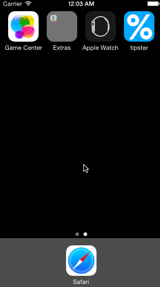

# tipster

This is an iOS demo application for calculating the amount to pay based on initial bill amount, tip percentage, and number of people splitting the bill

Time spent: 6 hours in total

### Completed user stories:

- [x] Required: User can enter a bill amount, choose a tip percentage, and see the tip and total values
- [x] Optional: Change the colors and fonts of the views
- [x] Optional: Add an app icon and launch image
- [x] Additional: Allow user to specify tip percentage by panning left/right
- [x] Additional: Allower user to specify the number of people by paning up/down

### Notes:

This only works for iPhone 5 in portrait orientation. As of now I haven't gotten the chance to make the app work across multiple phone resolutions

### Walkthrough for all user stories:

GIF created with [LiceCap](http://www.cockos.com/licecap/).
